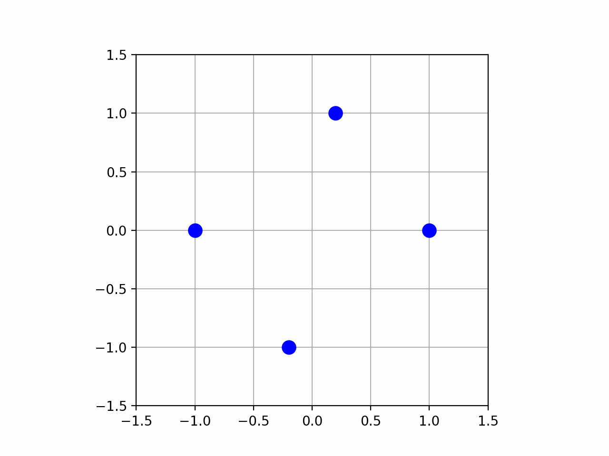

## Simulating Pendulums and Coupled Oscillators 

> The code is part of coursework, of the course -> Waves and Vibrations (Code -> PH2001)

## Introduction

This repository contains a collection of Python scripts designed to visualize and simulate two classic physical systems: the simple pendulum and a system of coupled masses and springs in a circular arrangement. The scripts utilize `numpy` for numerical calculations and `matplotlib` for generating static plots and dynamic animations.

### Prerequisites

To run these scripts, you will need the following Python libraries installed:
- `numpy`
- `matplotlib`
- `scipy`
- `pillow` (for saving animations as GIFs)

You can install them using pip:
```bash
pip install numpy matplotlib scipy pillow
```

---
## Sample output - Coupled Mass System


> NOTE: To be noted, the output is very very approximate and may not be the actual locus.

## File Descriptions

The scripts are divided into two main categories: simulations of a simple pendulum and simulations of a coupled spring-mass system.

### Part 1: Simple Pendulum Simulations

These scripts model the motion of a simple pendulum, illustrating both its possible path (locus) and its dynamic motion over time under the small-angle approximation (Simple Harmonic Motion).

#### 1. `Pendulum_locus.py`

*   **Purpose:** This script plots the complete locus (the set of all possible positions) of a simple pendulum's bob.
*   **Functionality:** It defines a function `simple_pendulum(theta, length)` that calculates the (x, y) coordinates of the pendulum bob for a given angle `theta`. It then generates a wide range of angles from -2π to 2π and plots the resulting circular path.
*   **Output:** A static `matplotlib` plot showing a circle, which represents the path the pendulum bob traces if it could swing through all possible angles.

#### 2. `Pendulum_anim.py`

*   **Purpose:** This script creates a real-time animation of a simple pendulum undergoing Simple Harmonic Motion (SHM).
*   **Functionality:** It uses the small-angle approximation, where the angular frequency `omega` is `sqrt(g/L)`. The angle `theta` is then defined as a function of time `t` (specifically, `theta(t) = A * cos(omega * t)`), where `A` is the initial amplitude. `matplotlib.animation.FuncAnimation` is used to repeatedly call an `update` function, which recalculates the pendulum's position at each frame and redraws the pendulum rod and bob.
*   **Output:** A window displaying a smooth animation of a pendulum swinging back and forth.

---

### Part 2: Coupled Spring-Mass System

These scripts attempt to model and visualize the oscillatory motion of four masses arranged in a circle, connected to each other by springs.

> **Important Note on Approximation:** The animations (`WV_HW_Ani.py`, `WV_HW_Test.py`, `WV_HW_GIF_Ani.py`) do not dynamically solve the true equations of motion for this complex system. Instead, they **prescribe an assumed oscillatory motion** to visually approximate what the system's normal modes might look like. The script `WV_HW.py` attempts a more rigorous simulation by solving a simplified set of differential equations. Therefore, the resulting loci and animations should be considered **highly approximate representations** of the true physical behavior.

#### 1. `WV_HW_Ani.py`

*   **Purpose:** This script provides a basic animation of the four masses oscillating in a coupled fashion.
*   **Functionality:** It places four masses equally spaced on a circle of radius `R`. The `update` function then adds a sinusoidal displacement to their positions over time. The formula used for displacement is an approximation and causes all masses to oscillate in a synchronized, complex pattern.
*   **Output:** An animation showing four blue dots moving in an oscillatory pattern around their initial circular positions.

#### 2. `WV_HW_GIF_Ani.py`

*   **Purpose:** This script is identical to `WV_HW_Ani.py` but with the added functionality of saving the generated animation as a GIF file.
*   **Functionality:** It uses the same animation logic as `WV_HW_Ani.py`. After creating the animation object, it calls the `ani.save()` method to write the animation to a file named `spring_mass_animation.gif`. This requires the `pillow` library.
*   **Output:** In addition to showing the animation in a window, it saves a `spring_mass_animation.gif` file in the same directory.

#### 3. `WV_HW_Test.py`

*   **Purpose:** This script attempts to visualize different normal modes of the spring-mass system.
*   **Functionality:** It defines a list of `modes`, where each mode is an array that specifies the relative amplitude and phase of each mass (e.g., `[1, 1, -1, -1]` suggests masses 1 and 2 move in phase, while masses 3 and 4 move in the opposite phase). The update loop applies these modes to the prescribed oscillation, intending to show how different modes behave. *Note: The current implementation plots all modes on top of each other, which may lead to a confusing visualization.*
*   **Output:** An animation that attempts to show the superposition or simultaneous behavior of different oscillation modes.

#### 4. `WV_HW.py`

*   **Purpose:** This script moves beyond prescribed motion and attempts to simulate the system by numerically solving the simplified differential equations of motion. It then plots the resulting locus for different initial conditions (modes).
*   **Functionality:**
    1.  It defines a function `equations(t, y, mode)` that represents the system of ordinary differential equations (ODEs), assuming each mass is only influenced by its two nearest neighbors.
    2.  For three different initial `mode` configurations, it uses `scipy.integrate.solve_ivp` to find the numerical solution for the positions of the masses over time.
    3.  Finally, it plots the trajectory (locus) of the masses for each simulation.
*   **Output:** Three separate `matplotlib` plots, each showing the path traced by the masses when the system is initialized in one of the three specified normal modes. These plots are a more physically-grounded (though still approximate) prediction of the system's locus.

---

### How to Run the Scripts

Navigate to the directory containing these files in your terminal. You can run any of the scripts using Python.

```bash
# To view the pendulum locus
python Pendulum_locus.py

# To see the pendulum animation
python Pendulum_anim.py

# To see the basic spring-mass animation
python WV_HW_Ani.py

# To generate the GIF of the spring-mass animation
python WV_HW_GIF_Ani.py

# To view the animation of different modes
python WV_HW_Test.py

# To run the simulation and plot the loci from the ODE solver
python WV_HW.py
```
